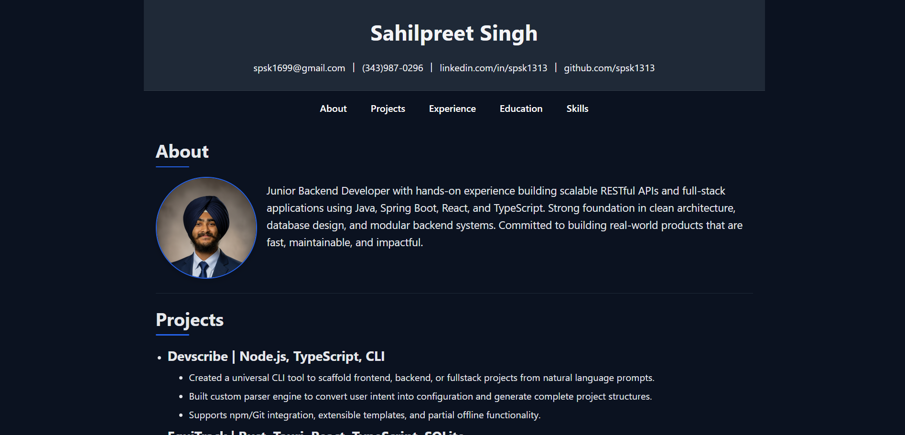
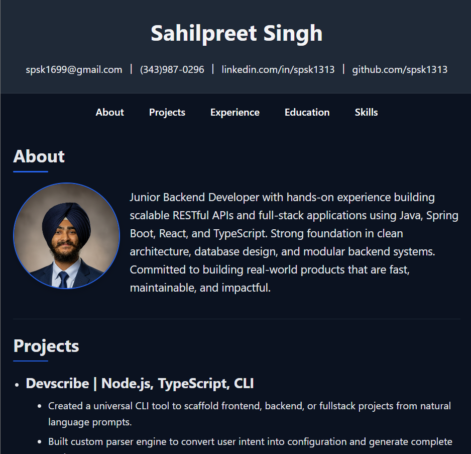
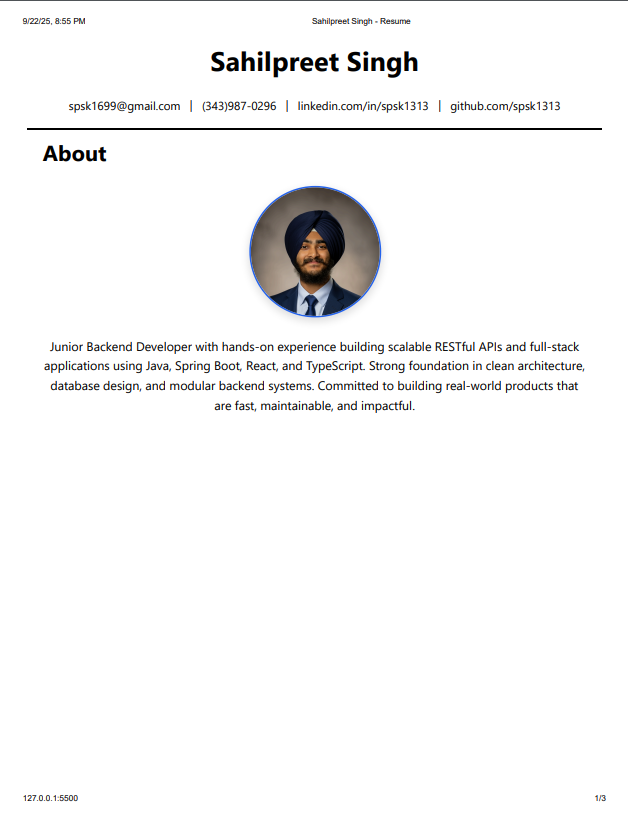

# Personal Profile Page — Semantic HTML + Responsive CSS

A single-page résumé/profile site built with **semantic HTML5** and **responsive CSS**.  
This project was completed as **Project 1: Personal Profile Page (Semantic HTML & Structure)**.

---

## 📌 Problem & Goals

**Problem:**  
Create a personal résumé/profile page that is **semantically correct**, **accessible**, and **readable on mobile and desktop**.

**Goals:**

- Use semantic HTML5 elements for clear structure (`header`, `nav`, `main`, `section`, `footer`).
- Organize content with a logical heading hierarchy (`h1 → h2 → h3`).
- Add an **About** section with an inline image and descriptive `alt` text.
- Provide a list of skills and structured project descriptions.
- Make the page responsive and mobile-friendly.
- Apply a consistent design theme with external CSS.

---

## ✅ Requirements (Acceptance Criteria)

- **Semantic structure**: used `<header>`, `<nav>`, `<main>`, `<section>`, `<footer>`.
- **About section with image**: includes a profile photo with descriptive `alt`.
- **Lists**: skills and project details use `<ul><li>`.
- **Contact info**: provided in `<address>` with `mailto:` and `tel:` links.
- **External CSS**: `index.css` with colors, spacing, and typography.
- **Responsive basics**:
  - Meta viewport tag included.
  - Mobile-first layout with media queries.
  - Flexible About section layout (stacked on mobile, side-by-side on desktop).

---

## 🧪 How to Run / Build / Test

1. Clone or download this project.
2. Open `index.html` directly in any modern browser (Chrome, Firefox, Safari, Edge).
3. Resize the window to test responsiveness.
4. Use **Print Preview** to see PDF/export-friendly styles.

---

## 📊 Evidence (Screenshots)

### Desktop View

### Tablet View

### Mobile View

### Print/PDF Export

---

## 💡 Reflections (What I Learned)

- How to use semantic HTML5 elements meaningfully.
- The importance of a logical **heading hierarchy** for accessibility and SEO.
- How `object-fit` and `object-position` control how images display inside fixed shapes.
- Writing **mobile-first CSS** with media queries for responsive layouts.
- How to create simple but effective **print styles** for exporting to PDF.

---

## 📝 License

This project is licensed under the **MIT License**.
